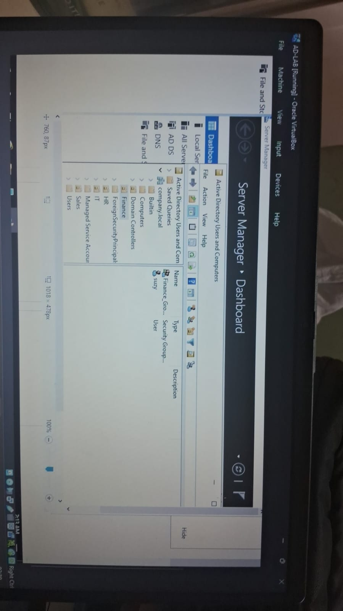
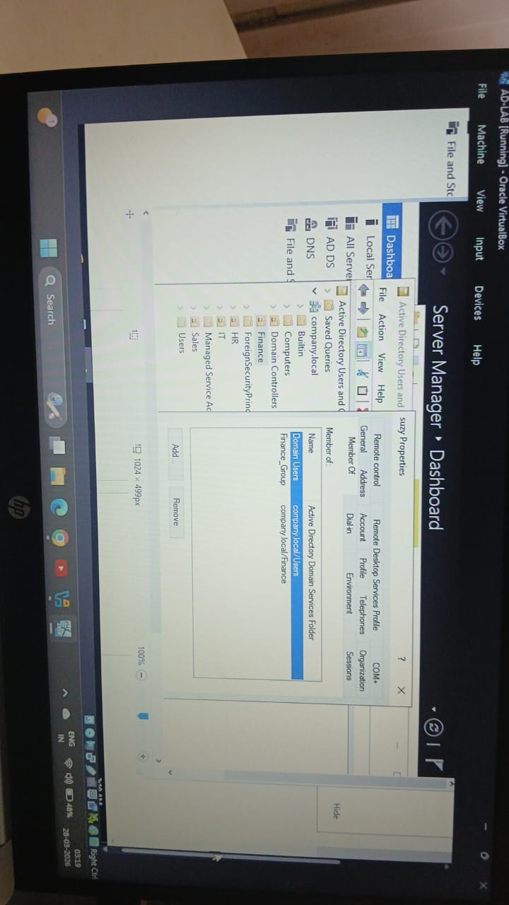
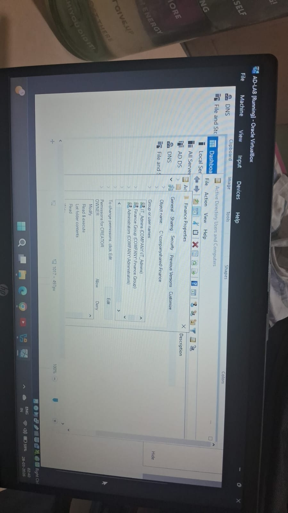

IAM JML Lab Project

Overview

This project demonstrates Identity and Access Management (IAM) concepts using Active Directory and Microsoft Entra ID. It simulates real-world enterprise scenarios including user lifecycle management and access control.

Key Concepts Implemented

- Identity and Access Management (IAM)
- Role-Based Access Control (RBAC)
- Joiner-Mover-Leaver (JML) lifecycle
- Multi-Factor Authentication (MFA)
- Single Sign-On (SSO)

Tools Used

- Active Directory (Windows Server in Virtual Machine)
- Microsoft Entra ID

Project Implementation

1. User Creation

Created a user (Suzy) in Active Directory and assigned login credentials.

2. RBAC (Group-Based Access)

Created a Finance group and added the user to the group instead of assigning permissions individually.

3. JML Lifecycle

- Joiner: Created user and assigned to Finance group
- Mover: Changed user role by updating group membership
- Leaver: Disabled user account to revoke access

4. Folder Access Control

Configured folder-level permissions using security groups to control access.

## Screenshots

### User Creation

### Group Membership

### Folder Permissions

## Access Request Workflow

This project follows a structured access control process similar to real-world enterprise environments:

1. User requests access to a specific resource (e.g., Finance folder)
2. Request is reviewed and approved by the reporting manager
3. IT administrator assigns the user to the appropriate security group
4. Access is granted automatically based on group membership
5. Access is revoked when the user leaves the organization or changes roles

Note: Access is not assigned directly to users. It is managed through security groups to ensure scalability and security.

## Outcome

This project demonstrates practical implementation of Identity and Access Management (IAM) concepts using Active Directory.

It simulates a real-world enterprise environment by implementing user lifecycle management (Joiner, Mover, Leaver), role-based access control (RBAC), and secure folder access using group-based permissions.

Additionally, it incorporates a structured access request workflow, ensuring that access is granted through proper approval and governance processes.

Overall, this project showcases hands-on experience in managing identities, controlling access, and following industry best practices in IAM.

